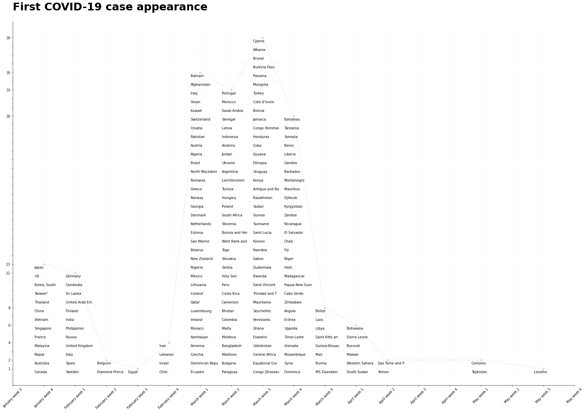

# Visualize COVID-19 confirmed cases

## Description
The plot shows the date when the first COVID-19 case appeared. It could be considered as a histogram plot of "the first case" distribution, where every bar represented as a set of country names. Names are ordered by the date of the first appearance from top to bottom, except the first bar (cause the first recorded point in dataset is not the first day of a pandemic). The dashed line helps to understand a general distribution.

It is not the best way to visualize the whole data cause it drops the information about trend, but definitely an unusual way to look at it and see the way how the virus was spread along the world and which countries fell first

Maybe a good next step is to visualize the first 100 (or 1000) cases in the same manner and compare it with the current plot.

https://colab.research.google.com/drive/1xu3Ww4-ro2f5iKAaFARyRtJq0eMtxie1?usp=sharing