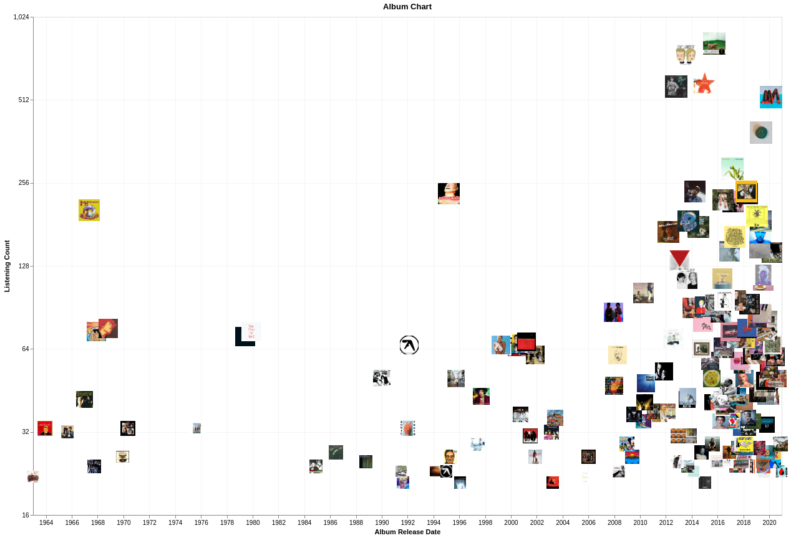

# Final Project, Data Viz 2020
## Data 
The main portion of data was fetched from **Apple Music**. There are such information as a tracks I have been listening during last one a half year, duration of played tracks, how do i find them, etc. The secondary data source was **Spotify API** from wich i was able to get detailed information almost for all tracks: album information, track dancability, valence, cover image.

## Motivation
The main goal was to get some insides about when and which music do I listen. 

## Charts
### Artist 

Interactive version https://data-viz.vercel.app/artist-chart.html

The idea was to show how to changes the band I was listened during a time and how many times it was listened.
There are several insides wich could be concluded:
- a huge decrease in amount of listened music from the end of Februar till August. Possibly it is realted with quarantine and there were not long trips to the office and back. Also interesting point that the music preferences chaged after such break (there are no connection between ) 

### Album

Interactive version https://data-viz.vercel.app/album-chart.html

### Genre

Interactive version https://data-viz.vercel.app/genre-chart.html

## Resources
- https://www.rcharlie.com/blog/fitter-happier/
